# Flask en SQLAlchemy - Theorie

## Database koppeling

Je hebt in week 3 al met SQLite gewerkt: tabellen, rijen, kolommen en SQL queries. Die kennis is hier direct van toepassing. Het verschil is de aanpak: in week 3 schreef je de SQL zelf, hier gebruik je een ORM.

## ORM - Object Relational Mapper

Een **Object Relational Mapper (ORM)** is een abstractielaag tussen Python en de database. Je beschrijft je data als Python klassen en objecten, de ORM vertaalt dat naar SQL.

De meest gebruikte ORM voor Python is **SQLAlchemy**. Voor Flask bestaat er een extensie: **Flask-SQLAlchemy**. Flask kan daarmee met verschillende SQL databases werken: PostgreSQL, MySQL, SQLite en anderen.

SQLAlchemy voegt een extra laag toe aan je applicatie architectuur:

```mermaid
flowchart TD
    A["🌐 Browser"] --> B["Flask\n(routes & templates)"]
    B --> C["SQLAlchemy ORM\n(Python objecten)"]
    C --> D["SQL"]
    D --> E[("SQLite\ndatabase")]
```



## Installatie

Voeg Flask-SQLAlchemy toe aan je project:

```console
uv add flask-sqlalchemy
```

## CRUD operaties

Met een database voer je vier basis operaties uit - **CRUD**:

operatie | Beschrijving
---|---
`CREATE` | Nieuwe records toevoegen
`READ`   | Gegevens opvragen (`SELECT`)
`UPDATE`| Gegevens wijzigen
`DELETE` | Gegevens verwijderen

## Werkwijze

### 1. Database configuratie

- Flask app aanmaken
- SQLAlchemy configureren (database locatie, opties)
- SQLAlchemy koppelen aan je Flask app

Deze configuratie doe je één keer per project.

### 2. Models definiëren

**Models** zijn Python klassen die tabellen representeren. Je schrijft een class, SQLAlchemy maakt de tabel.

Vergelijkbaar met `FlaskForm`, maar dan voor database tabellen:

1. Maak een class
2. Laat het erven van `db.Model`
3. Geef optioneel een tabelnaam op
4. Definieer kolommen als class attributen
5. Voeg `__init__` en `__repr__` methoden toe

### 3. CRUD operaties uitvoeren

Je gebruikt SQLAlchemy methoden om records toe te voegen, op te vragen, te wijzigen en te verwijderen.

**Volgende stap:** [Deel 2](flask-views-deel2.md) - Database setup en models.

## Samenvatting

In deze les heb je geleerd:

- **ORM**: een Object Relational Mapper is een abstractielaag waarmee je database-bewerkingen uitvoert via Python-objecten in plaats van rechtstreekse SQL.
- **SQLAlchemy en Flask-SQLAlchemy**: SQLAlchemy is de meest gebruikte Python ORM; Flask-SQLAlchemy is de bijbehorende Flask-extensie die installeerbaar is via `uv add flask-sqlalchemy`.
- **Architectuurlagen**: een Flask-applicatie met database werkt in lagen — browser → Flask (routes & templates) → SQLAlchemy ORM → SQL → SQLite.
- **CRUD**: de vier basisoperaties op een database zijn Create, Read, Update en Delete.
- **Models**: een model is een Python-klasse die erft van `db.Model` en een databasetabel representeert; kolommen worden als klasse-attributen gedefinieerd.
- **Werkwijze in drie stappen**: eerst de database configureren, dan models definiëren, en ten slotte CRUD-operaties uitvoeren.
