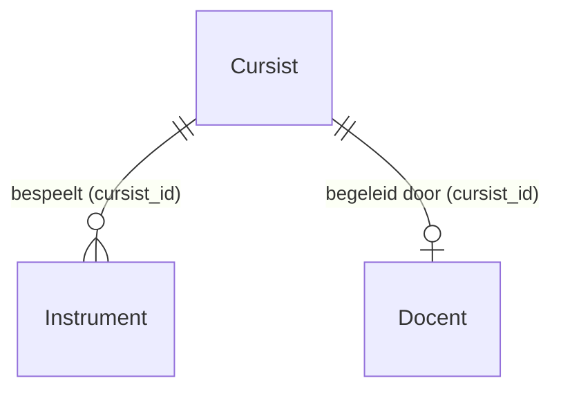
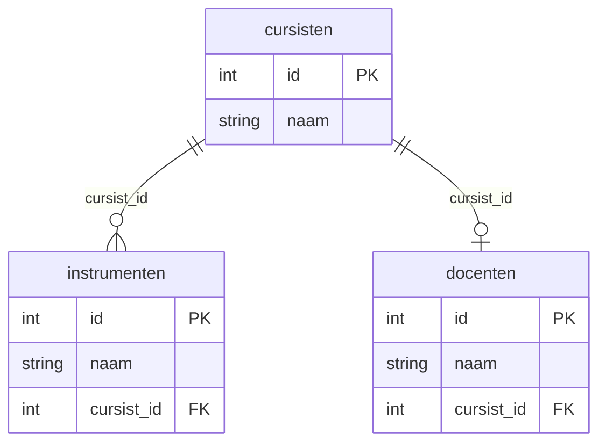

# Flask en SQLAlchemy - Relaties tussen tabellen

In grotere projecten heb je meerdere modellen die met elkaar samenhangen. Tot nu toe heb je gewerkt met één model (`Cursist`). De muziekschool heeft ook:

- **Instrument** - Instrumenten waarin de school lesgeeft
- **Docent** - Docenten die les geven

Deze modellen hebben relaties met elkaar:

- Een cursist kan **meerdere instrumenten** leren bespelen (één-op-veel)
- Een cursist heeft **één docent** (één-op-één)
- Een instrument wordt (in dit voorbeeld) door **één cursist** bespeeld



## Sleutels

### Primary Key (Primaire sleutel)

Elk model heeft een `id` kolom die de **primary key** is. Deze waarde is uniek per record en identificeert één specifieke rij.

`Cursist`:

- id (primary key, integer)
- naam (text)

`Instrument`:

- id (primary key, integer)
- naam (text)

`Docent`:

- id (primary key, integer)
- naam (text)

### Foreign Key (Refererende sleutel)

Om een **relatie** te leggen tussen tabellen gebruik je een **foreign key**. Dit is een kolom die verwijst naar de `id` van een ander model.

Voorbeeld: `Instrument` moet weten welke cursist het instrument bespeelt. Daarom krijgt `Instrument` een `cursist_id` kolom die verwijst naar `Cursist.id`.

## Database migraties met Flask-Migrate

Bij het werken met relaties is het handig om **Flask-Migrate** te gebruiken. Dit pakket helpt bij het aanmaken en wijzigen van database schema's.

Installeer Flask-Migrate:

```console
uv add flask-migrate
```

Flask-Migrate houdt bij welke wijzigingen je in je models maakt en past de database automatisch aan.

## Models met relaties (`models.py`)

Bestudeer het volledige bestand [`models.py`](bestanden/relaties/models.py).

### Setup

```python
import os
from flask import Flask
from flask_sqlalchemy import SQLAlchemy
from flask_migrate import Migrate
from sqlalchemy.orm import Mapped, mapped_column, relationship
from sqlalchemy import ForeignKey

basedir = os.path.abspath(os.path.dirname(__file__))

app = Flask(__name__)
app.config['SQLALCHEMY_DATABASE_URI'] = 'sqlite:///' + os.path.join(basedir, 'data.sqlite')
app.config['SQLALCHEMY_TRACK_MODIFICATIONS'] = False

db = SQLAlchemy(app)
Migrate(app, db)
```

`Migrate(app, db)` koppelt Flask-Migrate aan je applicatie.

### Cursist model met relaties

```python
class Cursist(db.Model):
    """Cursist van de muziekschool."""

    __tablename__ = 'cursisten'

    id: Mapped[int] = mapped_column(primary_key=True)
    naam: Mapped[str | None]

    # Één-op-veel relatie met instrumenten
    instrumenten: Mapped[list['Instrument']] = relationship(back_populates='cursist')

    # Één-op-één relatie met docent
    docent: Mapped['Docent | None'] = relationship(back_populates='cursist')

    def __init__(self, naam: str):
        """Maak nieuwe cursist aan.

        Args:
            naam: Voor- en achternaam
        """
        self.naam = naam

    def __repr__(self) -> str:
        """String representatie."""
        if self.docent:
            return f"Cursist {self.naam} heeft {self.docent.naam} als docent"
        else:
            return f"Cursist {self.naam} heeft nog geen docent toegewezen gekregen"

    def overzicht_instrumenten(self) -> list[str]:
        """Geef lijst van instrumentnamen terug.

        Returns:
            Lijst met namen van instrumenten
        """
        return [instr.naam for instr in self.instrumenten]
```

**Relaties uitleg**:

**Één-op-veel (Cursist ↔ Instrumenten)**:

```python
instrumenten: Mapped[list['Instrument']] = relationship(back_populates='cursist')
```

- `Mapped[list['Instrument']]` - Lijst van Instrument objecten (één-op-veel)
- `back_populates='cursist'` - Koppelt aan de `cursist` relatie in het `Instrument` model

**Één-op-één (Cursist ↔ Docent)**:

```python
docent: Mapped['Docent | None'] = relationship(back_populates='cursist')
```

- `Mapped['Docent | None']` - Eén object of None (één-op-één)

!!! note "Return values in plaats van print"
    De `overzicht_instrumenten()` methode **geeft een lijst terug** in plaats van printen. Dit kun je gebruiken in routes en templates.

### Instrument model

```python
class Instrument(db.Model):
    """Instrument waarin de school lesgeeft."""

    __tablename__ = 'instrumenten'

    id: Mapped[int] = mapped_column(primary_key=True)
    naam: Mapped[str | None]

    # Foreign key naar cursisten tabel
    cursist_id: Mapped[int | None] = mapped_column(ForeignKey('cursisten.id'))
    cursist: Mapped['Cursist | None'] = relationship(back_populates='instrumenten')

    def __init__(self, naam: str, cursist_id: int):
        """Maak nieuw instrument aan.

        Args:
            naam: Naam van het instrument
            cursist_id: ID van de cursist die dit instrument bespeelt
        """
        self.naam = naam
        self.cursist_id = cursist_id
```

**Foreign key**: `ForeignKey('cursisten.id')` verwijst naar de **tabelnaam** (`cursisten`), niet de class naam.

### Docent model

```python
class Docent(db.Model):
    """Docent die lesgeeft aan één cursist."""

    __tablename__ = 'docenten'

    id: Mapped[int] = mapped_column(primary_key=True)
    naam: Mapped[str | None]

    # Foreign key naar cursisten tabel
    cursist_id: Mapped[int | None] = mapped_column(ForeignKey('cursisten.id'))
    cursist: Mapped['Cursist | None'] = relationship(back_populates='docent')

    def __init__(self, naam: str, cursist_id: int):
        """Maak nieuwe docent aan.

        Args:
            naam: Voor- en achternaam
            cursist_id: ID van de cursist die deze docent begeleidt
        """
        self.naam = naam
        self.cursist_id = cursist_id
```

## Database aanmaken met migraties

Nu je `models.py` hebt met alle relaties, maak je de database aan:

**1. Stel FLASK_APP in**:

=== "Linux / macOS"
    ```console
    export FLASK_APP=models.py
    ```

=== "Windows (cmd)"
    ```console
    set FLASK_APP=models.py
    ```

=== "Windows (PowerShell)"
    ```console
    $Env:FLASK_APP = "models.py"
    ```

**2. Initialiseer migraties**:

```console
flask db init
```

Dit maakt een `migrations/` directory aan.

**3. Maak eerste migratie**:

```console
flask db migrate -m "Initial migration"
```

Flask-Migrate detecteert je models en maakt migratie scripts.

**4. Voer migratie uit**:

```console
flask db upgrade
```

Nu worden de tabellen aangemaakt in `data.sqlite`.

## Data toevoegen met relaties

Bestudeer het volledige bestand [`populate_database.py`](bestanden/relaties/populate_database.py).

```python
from models import db, Cursist, Instrument, Docent

# Maak cursisten aan
joyce = Cursist("Joyce")
bram = Cursist("Bram")

db.session.add_all([joyce, bram])
db.session.commit()

# Controleer
print(db.session.execute(db.select(Cursist)).scalars().all())
# [Cursist Joyce heeft nog geen docent toegewezen gekregen,
#  Cursist Bram heeft nog geen docent toegewezen gekregen]

# Zoek Joyce op
joyce = db.session.execute(db.select(Cursist).filter_by(naam='Joyce')).scalar_one_or_none()

# Voeg docent toe voor Joyce
david = Docent("David", joyce.id)

# Voeg instrumenten toe voor Joyce
instr1 = Instrument('Drums', joyce.id)
instr2 = Instrument("Piano", joyce.id)

db.session.add_all([david, instr1, instr2])
db.session.commit()

# Check de relaties
joyce = db.session.execute(db.select(Cursist).filter_by(naam='Joyce')).scalar_one_or_none()
print(joyce)
# Cursist Joyce heeft David als docent

print(joyce.overzicht_instrumenten())
# ['Drums', 'Piano']
```

Output:

```console
[Cursist Joyce heeft nog geen docent toegewezen gekregen, Cursist Bram heeft nog geen docent toegewezen gekregen]
Cursist Joyce heeft David als docent
['Drums', 'Piano']
```

!!! tip "Query methoden"
    - `db.session.execute(db.select(Model)).scalars().all()` - Alle records
    - `db.session.execute(db.select(Model).filter_by(naam='Joyce')).scalar_one_or_none()` - Filter op naam
    - `db.session.get(Model, id)` - Zoek op primary key

De database structuur:



## Relaties gebruiken

Via de `back_populates` parameter kun je in beide richtingen navigeren:

```python
# Van cursist naar instrumenten
joyce.instrumenten  # Alle instrumenten van Joyce

# Van instrument naar cursist (via back_populates)
drums = db.session.execute(db.select(Instrument).filter_by(naam='Drums')).scalar_one_or_none()
drums.cursist  # Geeft Joyce object terug
drums.cursist.naam  # "Joyce"
```

**Volgende stap:** [Deel 5](flask-views-deel5.md) - Complete Flask applicatie met database.
