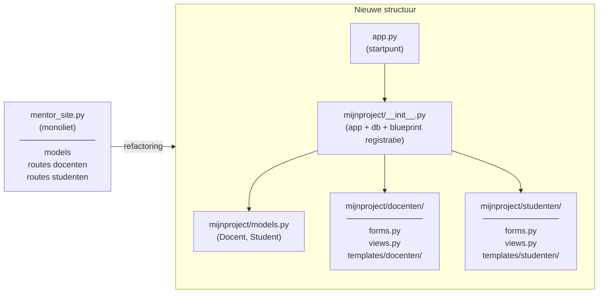

# Flask-applicaties - Structuur

## Refactoring

Tot nu toe zijn alle coderegels in één `app.py`-bestand ondergebracht. Voor grotere Flask-applicaties is het logischer om delen van de applicatie in hun eigen bestanden vast te leggen bijvoorbeeld in `models.py`, `forms.py` en `views.py`.

Voor nog grotere toepassingen begint het logisch te worden om de bestanden te herstructureren en componenten te scheiden zoals forms, views en templates voor elke belangrijke component.

In dit deel hebben we aandacht voor de wijze waarop de ontwikkelde applicatie van [oefening 1](../week6/oefeningen/flask-views-oefening1.md) *gerefactored* kan worden. Bij die oefening waren alle formulieren, views en templates in een enkel bestand of directory opgenomen. Zo maakte je een bestand `mentor_site.py`, waarin zowel het model als de verschillende routes waren opgenomen, en had je ook een bestand `forms.py`, waarin je de verschillende formulier-klassen had aangebracht.

[Refactoren is een andere structuur aan code (of eigenlijk een hele *code-base*) geven](https://en.wikipedia.org/wiki/Code_refactoring). In dit geval wordt het bestand `mentor_site.py` (dat je bij de vorige oefening hebt gemaakt) opgesplitst in afzonderlijke componenten voor de hierboven genoemde aspecten. In plaats van `mentor_site.py` wordt vanaf nu `app.py` gehanteerd.



!!! Tip "Gebruik een bibliotheek"
    De [`blueprints`](https://flask.palletsprojects.com/en/3.0.x/blueprints/)-bibliotheek kan gebruikt worden om deze afzonderlijke modulaire componenten te verbinden met het hoofdbestand `app.py`. Hier komen we zo op terug.

Houd er rekening mee dat de `app.py` nog steeds een rol speelt, alleen verwijst het nu alleen nog naar de subcomponenten in plaats van zelf alle code te bevatten.

## Nieuwe structuur

Tijd om de definitieve structuur aan te brengen voor deze applicatie. Let op, dit is een best lang overzicht:

- `app.py` (main `app.py`-bestand dat moet worden aangeroepen om de server voor de webapp te starten)
- `requirements.txt` (Bestand waarin de *dependencies* zijn opgeslagen)
- mijn_project (project map, sub-componenten in aparte mappen)
  - `data.sqlite`
  - `models.py`
  - `__init__.py`
  - docenten
    - `forms.py`
    - `views.py`
    - templates
      - docenten
        - `add.html`
        - `delete.html`
        - `list.html`
  - studenten
    - `forms.py`
    - `views.py`
    - templates
      - studenten
        - `add.html`
  - static (voor de opslag van CSS, JS, afbeeldingen, lettertypen etc.)
  - templates
    - `base.html`
    - `home.html`

!!! info "requirements.txt"
    In Python projecten zal je vaak een `requirements.txt` bestand zien. Dit is een bestand waar de afhankelijkheden (de gebruikte modules) van de applicatie zijn beschreven. Je kan met `pip` de geïnstalleerde modules als volgt naar dit bestand laten schrijven:

    ```console
    pip freeze > requirements.txt
    ```

    Als je vervolgens de inhoud van `requirements.txt` bekijkt zal je zien dat het modules bevat inclusief versienummer, bijvoorbeeld `Flask==1.1.2`. Dit bestand wordt ook gebruikt om in bijvoorbeeld een nieuwe virtuele omgeving de vereiste modules te installeren, bijvoorbeeld:

    ```console
    pip install -r requirements.txt
    ```

    Het vastzetten van modules en bijbehorende versienummers is een manier om een repliceerbare omgeving voor een applicatie te gegaranderen, bijvoorbeeld als het live op een server moet draaien of wanneer je met andere mensen aan een project gaat samenwerken.

In de volgende paragraaf wordt een applicatie omgeschreven naar een meer overzichtelijke vorm. Als voorbeeld gebruiken we de applicatie van de oefening uit het deel waarin voor het eerst een website gebouwd is.

## Samenvatting

In deze les heb je geleerd:

- **Refactoring**: het herschikken van de codestructuur zonder de functionaliteit te wijzigen; een monolithisch bestand (mentor_site.py) wordt opgesplitst in afzonderlijke componenten
- **Projectstructuur**: een Flask-applicatie krijgt een vaste hiërarchie met een hoofdbestand app.py en een projectmap met subfolders per domein (docenten, studenten)
- **Scheiding van verantwoordelijkheden**: models, views, forms en templates worden elk in eigen bestanden en mappen per onderdeel ondergebracht
- **`requirements.txt`**: bestand dat alle Python-afhankelijkheden inclusief versienummers vastlegt, zodat de omgeving reproduceerbaar is op andere machines of servers
- **`pip freeze`**: commando om geïnstalleerde pakketten naar requirements.txt te exporteren; `pip install -r requirements.txt` installeert ze opnieuw in een nieuwe omgeving
- **`static`-map**: vaste locatie binnen het project voor CSS, JavaScript, afbeeldingen en lettertypen
- **Blueprints (preview)**: Flask-mechanisme waarmee modulaire subcomponenten straks aan de hoofdapplicatie gekoppeld kunnen worden via een url_prefix
